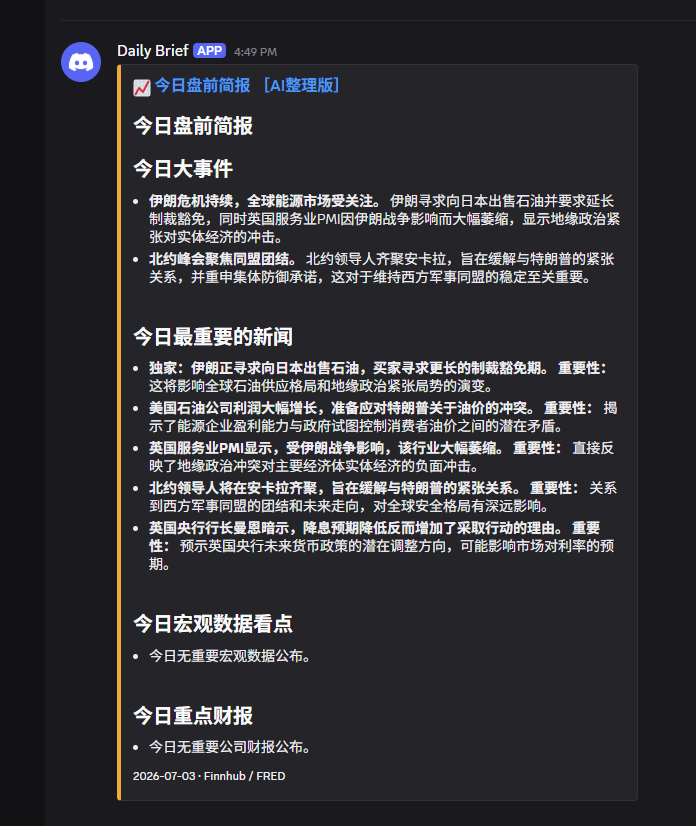
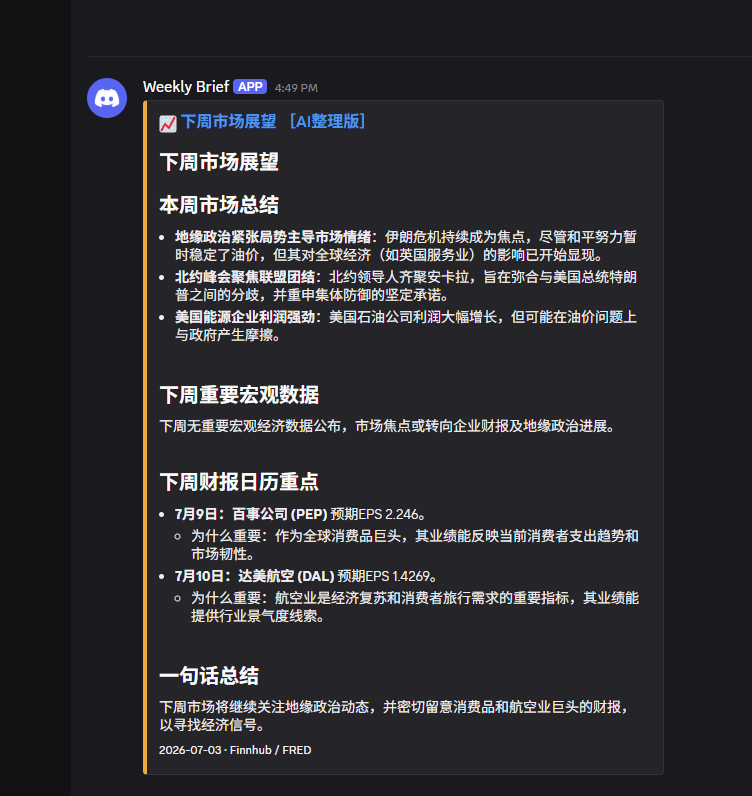
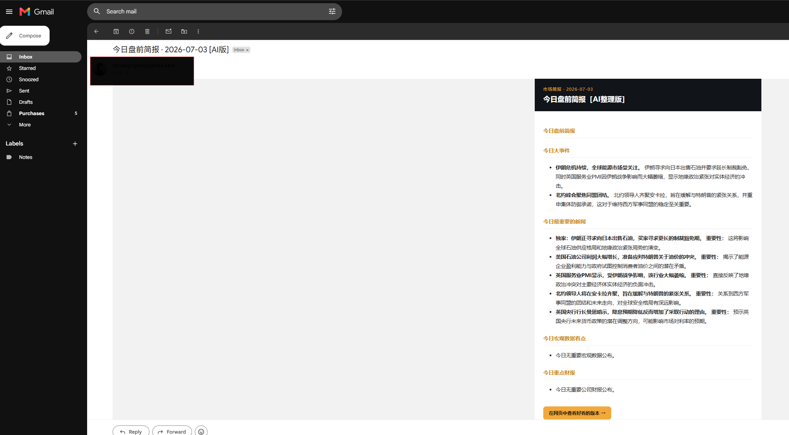
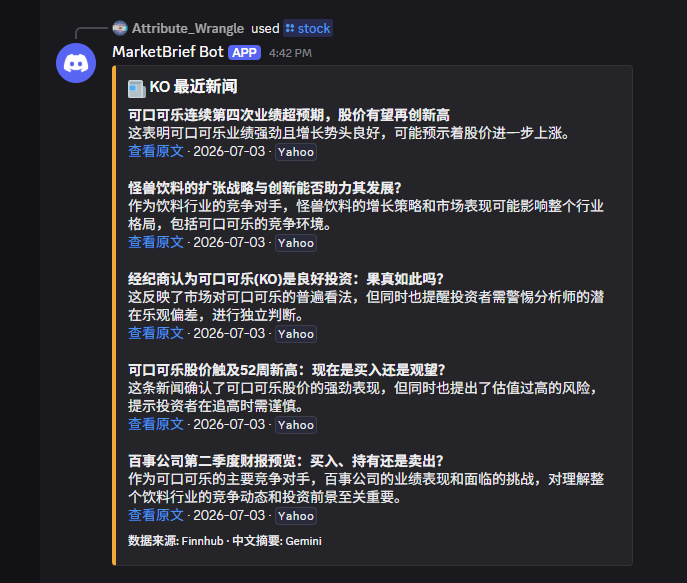

# 市场简报自动化 · 全免费方案

每天盘前 + 每周日晚, 自动抓数据 → AI整理(失败自动降级) → 发邮件(HTML富文本) + 发Discord(分频道) +
生成一份卡片风格的网页版(GitHub Pages托管)。另外还有一个可选的Discord `/stock` 查询指令
(在 `discord-bot/` 文件夹, 单独部署, 会把新闻标题翻译成中文并附带原文链接和日期)。

全程零成本, 部署完之后不需要你的电脑一直开着——所有东西都跑在云端
(GitHub Actions + Cloudflare Workers), 跟你的电脑没有任何关系, 关机/换电脑都不影响运行。

## 效果预览

**每日盘前简报(Discord)**



**每周市场展望(Discord)**



**邮件版(HTML富文本, 底部带"查看网页版"链接)**



**`/stock` 查询指令(中文翻译+原文链接+日期)**



## 目录结构

```
market-brief/
├── main.py                      # 每日/每周简报核心脚本
├── requirements.txt
├── .gitignore
├── README.md                    # 本文档
├── screenshots/                 # README里的效果预览图
├── .github/workflows/
│   ├── daily-premarket.yml      # 每日盘前定时任务
│   ├── weekly-summary.yml       # 每周总结定时任务
│   └── keepalive.yml            # 仓库保活(防止GitHub暂停定时任务)
└── discord-bot/                 # /stock 指令(单独部署在Cloudflare Workers)
    ├── worker.js
    ├── wrangler.toml
    ├── package.json
    ├── register_command.py
    └── README.md                # 这部分单独的详细说明
```

## 这套东西是不是一直免费、不用管？

| 环节 | 免费程度 |
|---|---|
| GitHub Actions | 私有仓库每月2000分钟免费额度, 这套脚本一天用不到几分钟, 长期免费 |
| Cloudflare Workers | 每天10万次请求免费, 个人用量不可能触顶, 长期免费 |
| Finnhub / FRED / Gmail SMTP / GitHub Pages | 个人使用场景下都是长期免费 |
| **Gemini API 免费层** | ⚠️ 唯一不能打包票"永远不变"的一环。Google 2025年底砍过一次免费额度, 目前用量远低于限额不受影响, 但这是"目前免费"不是"合同保证"。真被大幅收紧的话, 你会在邮件/Discord标题看到"无AI降级版"字样, 那就是信号 |

结论: **目前全免费, 部署完基本不用管。**

## 你需要准备的东西 (都免费)

### 1. Finnhub API Key (数据源: 财报日历/新闻)
打开 https://finnhub.io/register 注册, Dashboard首页能看到Key。免费额度60次/分钟。

### 2. FRED API Key (数据源: 官方宏观经济日历)
打开 https://fredaccount.stlouisfed.org/apikeys 注册/登录, 申请一个Key(即时到账)。
圣路易斯联储官方数据, CPI/非农/PPI/GDP这些发布日期都从这里拿。

### 3. Gemini API Key (AI整理)
打开 https://aistudio.google.com/apikey, 用Google账号登录, 点 "Create API Key"。
免费额度一天几百到上千次, 用不完。这个key每日简报脚本和discord-bot共用同一个就行。

### 4. Gmail 应用专用密码 (发邮件用)
⚠️ 不能直接用Gmail登录密码:
1. 打开 https://myaccount.google.com/apppasswords
   (打不开的话先去 https://myaccount.google.com/security 开启"两步验证")
2. 生成一个新的应用密码, 得到一串16位密码, 这个才是脚本要用的

### 5. 两个 Discord Webhook (分别对应两个频道)
"每日盘前简报"和"每周市场展望"要发到不同频道, 所以要申请两个:
打开对应频道 → 频道设置 → 整合(Integrations) → Webhook → 新建, 复制URL, 两个频道各来一次。

## 部署步骤

1. 把这个文件夹传到一个新的 GitHub 仓库(私有仓库即可)
2. 进仓库 Settings → Secrets and variables → Actions → New repository secret,
   依次添加以下8个secret(名字必须完全一致):

   | Secret 名称 | 值 |
   |---|---|
   | `FINNHUB_API_KEY` | 第1步拿到的key |
   | `FRED_API_KEY` | 第2步拿到的key |
   | `GEMINI_API_KEY` | 第3步拿到的key |
   | `GMAIL_ADDRESS` | 你的Gmail邮箱地址 |
   | `GMAIL_APP_PASSWORD` | 第4步拿到的16位应用密码 |
   | `EMAIL_TO` | 你想接收简报的邮箱 |
   | `DISCORD_WEBHOOK_DAILY` | 第5步"每日盘前简报"频道的webhook |
   | `DISCORD_WEBHOOK_WEEKLY` | 第5步"每周市场展望"频道的webhook |

3. 去仓库的 Actions 标签页, 应该能看到三个工作流: "每日盘前简报"、"每周市场总结"、"仓库保活"
4. 手动测试: 点进任意一个工作流, 右上角 "Run workflow" 点一下立即触发, 邮件/Discord都能收到
   就说明基础配置正确
5. **真正的自动定时触发**, 见下面"关于定时触发"这一节 —— 这一步不能跳过, 否则daily/weekly
   永远只会在你自己手动点"Run workflow"的时候才运行

## 网页版 (GitHub Pages, 卡片风格)

Discord和邮件都没法内嵌一个有CSS样式的自定义网页, 所以做法是: 脚本每次运行都生成一个卡片风格的
HTML页面(每个板块一张独立方块卡片), 存进仓库的 `docs/` 目录, 用 GitHub Pages 免费托管,
邮件正文最下面和Discord卡片标题都带一个链接, 点开就是网页版。

开启步骤(只需要设置一次):
1. 仓库 Settings → Pages → Source 选 "Deploy from a branch" → Branch选 `main`,
   文件夹选 `/docs` → 保存
2. 稍等一两分钟, GitHub会给你一个网址: `https://<你的GitHub用户名>.github.io/<仓库名>`
3. 回到 Settings → Secrets and variables → Actions → 切到 "Variables" 标签(不是Secrets),
   新建一个 repository variable: 名称 `PAGES_BASE_URL`, 值填上一步的网址(结尾不要带斜杠)
4. 之后每次简报都有稳定链接: `.../daily.html`(每日最新, **每次运行会被覆盖**)、
   `.../weekly.html`(每周最新, 同样会被覆盖), 另外还会存一份带日期的存档比如
   `daily-2026-07-06.html`(**这个不会被覆盖**), 方便回看历史。
   **存档只保留最近30天**, 更早的会被脚本自动清理, 不用你操心 `docs/` 目录无限膨胀。

⚠️ **首次开启Pages的已知坑**: GitHub默认会用Jekyll去"构建"`docs/`目录, 但里面是纯HTML文件不是
Jekyll项目结构, 会报错(类似 `No such file or directory @ dir_chdir0` 或SCSS相关报错)。
这版代码已经会自动在 `docs/` 里创建一个空文件 `.nojekyll` 来避免这个问题, 但如果你是在这个修复
生效之前就开启过Pages导致报错发生过一次, 需要手动补一次: 去仓库网页 "Add file" →
"Create new file", 文件名输入 `docs/.nojekyll`, 内容留空, 直接commit, 触发一次新构建即可。

## 关于定时触发：为什么用外部服务，不是GitHub自带的schedule

⚠️ **这是一个重要的架构变更，跟你如果看到旧版说明/旧代码会不一样。**

最初这套代码用的是GitHub Actions自带的 `schedule:` 定时触发(cron), 并且做了一层"自动判断夏令时"
的保护逻辑。但实测下来, **这个仓库的原生schedule触发器反复验证多次都没有正常工作过**——workflow
本身、cron表达式写法都没有问题, 手动触发(`workflow_dispatch`)完全正常, 但GitHub自己的定时器
就是不会在到点时自动创建运行记录。这是GitHub Actions一个被社区反复反馈过的已知怪癖(schedule
注册流程偶尔会"卡住"), 不是这份代码的bug, 但既然反复确认无法修复, 就换了更可靠的方案。

**现在的方案**: 用免费的外部定时服务 **cron-job.org**, 到点主动调用GitHub API的
`workflow_dispatch` 接口去触发workflow, 效果等同于你自己手动点"Run workflow"按钮,
只是变成外部服务自动帮你点。这样完全绕开了GitHub自己那个不稳定的schedule机制。

也因为这样, `main.py` 里原本那层"判断现在是不是真的到了目标时间(应对夏令时)"的保护逻辑也
删掉了——不再需要, 因为cron-job.org本身就支持直接设置时区(`America/New_York`), 会精确按
当地时间触发, 夏令时切换它自己处理, 不需要脚本再判断一次。

### 设置步骤

**第一步: 生成一个GitHub Token**
1. GitHub右上角头像 → Settings → 左侧最下面 "Developer settings"
2. "Personal access tokens" → "Tokens (classic)" → "Generate new token (classic)"
3. 勾选权限范围 `repo`, 生成后立刻复制保存(只显示一次)

**第二步: 去 https://cron-job.org 免费注册账号**

**第三步: 建两个cronjob**(daily和weekly各一个), 都用 Advanced 标签页配置:

| 字段 | daily的值 | weekly的值 |
|---|---|---|
| URL | `https://api.github.com/repos/你的用户名/仓库名/actions/workflows/daily-premarket.yml/dispatches` | 同理换成 `weekly-summary.yml` |
| Request method | POST | POST |
| Headers | `Authorization: Bearer 你的token`<br>`Accept: application/vnd.github+json` | 同左 |
| Request body | `{"ref":"main"}` | `{"ref":"main"}` |
| Time zone | America/New_York | America/New_York |
| 执行时间 | 周一到周五 8:30 | 周日 18:00 |

设置完先点 "TEST RUN" 测试一次，返回状态码 `204` 就是成功，再点 "CREATE" 保存。

### 仓库这边要确认的权限

Settings → Actions → General → **"Workflow permissions"** 要选 **"Read and write permissions"**
(不是默认的只读)，因为脚本最后一步要把生成的网页commit回仓库。

## 仓库保活 (`keepalive.yml`)

这个workflow还在用GitHub原生的 `schedule:` 触发(每月1号自动提交一次), **当初的目的**是防止
"仓库连续60天没提交, GitHub自动暂停定时任务"这条规则生效。

现状说明: 既然daily/weekly已经改成外部cron-job.org触发(不再依赖GitHub的schedule机制),
这条"60天暂停schedule"的规则对它们来说已经不适用了; 而且daily/weekly本来就一天/一周跑一次,
只要跑成功通常会commit(网页内容变了), 仓库天然保持活跃, `keepalive.yml` 现在更多是锦上添花,
不是必需品。如果你发现连这个也没能自动触发(大概率会, 因为跟daily/weekly当初遇到的是同一个
repo级别的schedule注册问题), 不用特意去修——它的存在意义已经不大, 可以不用管, 也可以照着
上面"关于定时触发"那节的方法, 一样用cron-job.org每月调用一次它的 `workflow_dispatch`。

## 换电脑 / 重新clone仓库之后要做什么

**如果只是想让现有的东西继续运行**: 什么都不用做。GitHub Actions和Cloudflare Worker都是云端
独立运行的, 跟你电脑无关, 密钥也都存在GitHub/Cloudflare账号里, 不在本地。换电脑、关机、清空
硬盘都不影响它们继续工作。

**如果想在新电脑上继续改代码**:
```bash
git clone <你的仓库地址>
cd market-brief
pip install -r requirements.txt          # 只有想本地测试main.py时才需要
```
如果要改并重新部署Discord bot:
```bash
cd discord-bot
npm install
npx wrangler login    # 登录同一个Cloudflare账号, 浏览器会弹出授权页面
npm run deploy
```
**不需要重新申请任何API Key, 不需要重新设置任何secret**, 那些都是一次性配置, 已经在云端了。

## 本地测试 (可选)

```bash
pip install -r requirements.txt

export FINNHUB_API_KEY="xxx"
export FRED_API_KEY="xxx"
export GEMINI_API_KEY="xxx"
export GMAIL_ADDRESS="xxx@gmail.com"
export GMAIL_APP_PASSWORD="xxx"
export EMAIL_TO="xxx@gmail.com"
export DISCORD_WEBHOOK_DAILY="https://discord.com/api/webhooks/xxx"
export DISCORD_WEBHOOK_WEEKLY="https://discord.com/api/webhooks/yyy"
export PAGES_BASE_URL="https://你的用户名.github.io/仓库名"   # 可选

python main.py --mode daily
```

⚠️ **Windows用户注意**: `export` 是Mac/Linux(bash)语法, Windows不通用, 会报
`'export' is not recognized as an internal or external command`。按你的终端类型换语法:
- **CMD**(提示符像 `C:\Users\你的名字>`): `set 变量名=值`(不需要引号)
- **PowerShell**(提示符像 `PS C:\Users\你的名字>`): `$env:变量名="值"`

本地跑不受任何时间限制, 随时能跑(那层判断逻辑已经移除, 见上面"关于定时触发"章节)。

## Discord `/stock` 查询指令 (可选功能, 单独部署)

在 `discord-bot/` 文件夹里, 让你在Discord输入 `/stock ticker:AAPL` 就能查某只股票最近一周的
新闻, 标题会被翻译成中文并附带一句话解读、原文链接、发布日期。部署在Cloudflare Workers, 免费。
详细步骤 + 踩坑记录见 `discord-bot/README.md`。

⚠️ 这个和上面的每日/每周简报是**两套独立的基础设施**, 因为斜杠指令需要"随时能被Discord调用"的
能力, 定时任务做不到这件事。两边共用同一个 Finnhub Key 和 Gemini Key 就行, 不用分开申请。

## git 使用注意事项

`.gitignore` 已经配置好排除 `node_modules/`(npm依赖目录, 几千个文件, 不应该提交,
别人 `npm install` 会自动生成)。如果你之前不小心把它提交上去过, 清理方法:
```bash
git rm -r --cached discord-bot/node_modules
git add .gitignore
git commit -m "chore: 移除node_modules"
git push
```

push被拒绝(`rejected... fetch first`)通常是远程有你本地没有的新提交(比如GitHub Actions机器人
commit了`docs/`里的网页文件), 先 `git pull origin main`(弹出编辑器直接保存关闭), 再 `git push`。

commit信息里中文显示乱码(`Σ┐«σñì...`)是Windows CMD编码问题, 不影响代码内容, 忽略即可,
或者以后commit信息用英文更省事。

## 当前版本的已知局限

- **FRED只给官方发布日期, 不含市场预期值**: 商业数据商(如Trading Economics)才有"预期值/前值",
  简报里的"意义解读"是AI基于数据本身的常识写的。
- **财报日历用白名单过滤噪音**: `main.py` 顶部的 `MAJOR_TICKERS` 维护了约80个大市值公司,
  可以随时增删。某周这些公司都没财报时会自动退回显示全量列表, 避免空白。
- **新闻没有精细筛选**: 抓的是Finnhub general分类的通用财经新闻, 质量依赖Gemini整理时的判断。
- **邮件HTML用的是内联样式的简化版设计**, 主流邮箱(Gmail/Apple Mail)显示没问题,
  个别老旧邮件客户端(比如Outlook桌面版)可能样式还原度打折扣。
- **没有联储官员讲话日程**: 目前没有免费API能稳定覆盖。

这些都不影响先跑起来看效果, 跑几天觉得哪块不准/不够用, 随时可以再调整。
